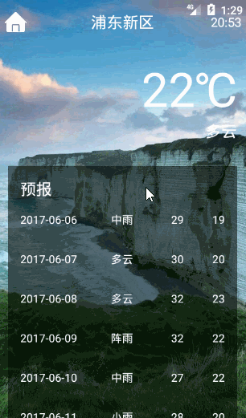

# CoolWeather
A  weather app 

This app uses five open resources:
- [litepal][1]
- [okhttp][2]
- [butterknife][3]
- [gson][4]
- [glide][5]

If you want to know more about it ,you can click [this][6].

  [1]: https://github.com/LitePalFramework/LitePal
  [2]: https://github.com/square/okhttp
  [3]: https://github.com/JakeWharton/butterknife
  [4]: https://github.com/google/gson
  [5]: https://github.com/bumptech/glide
  [6]: http://blog.csdn.net/fessible_max/article/details/72887723
